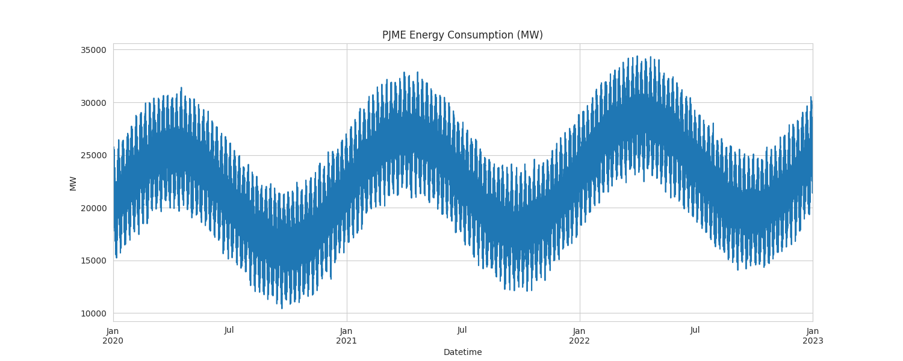
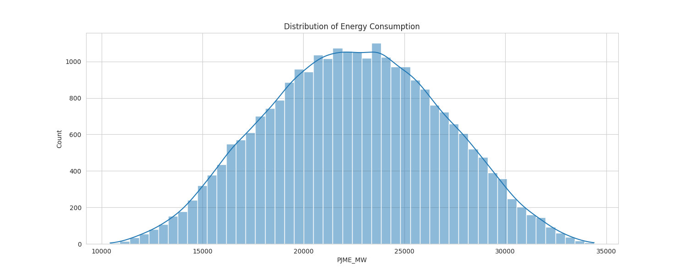
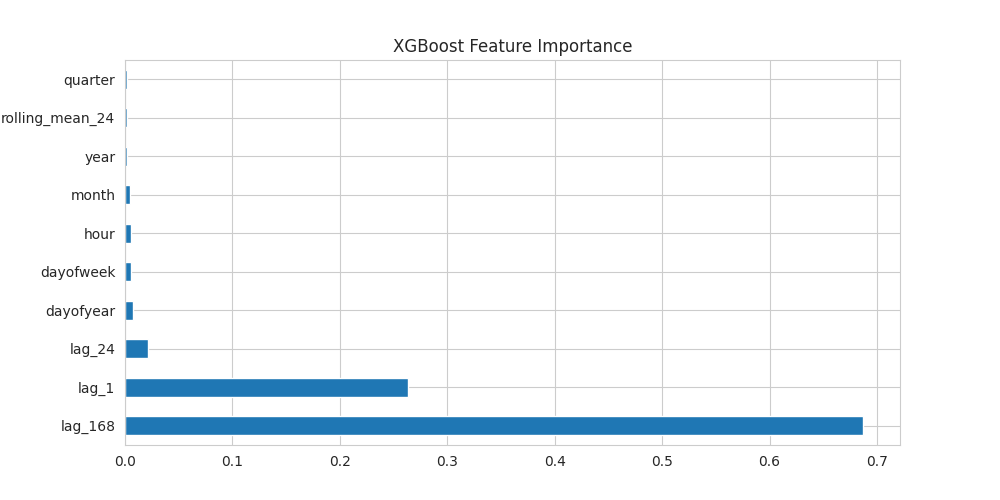

# ЗВІТ з практичного заняття №14: Наука і техніка

**Тема:** Прогнозування енергоспоживання (Track A)
**Студентка:** Зоріна Софія

## 1. Постановка задачі
**Мета:** Побудувати модель прогнозування погодинного енергоспоживання, що перевершує наївний сезонний прогноз.

## 2. Дані та EDA (Розвідувальний аналіз)
Використано погодинний часовий ряд (3 роки). Нижче наведено аналіз структури даних.

**2.1. Загальний огляд споживання:**
На графіку видно загальний тренд та сезонність.

**2.2. Розподіл споживання (Гістограма):**
Графік показує частоту різних рівнів навантаження на мережу.

**2.3. Тижневий профіль (останні 7 днів):**
Чітко простежуються добові цикли (день/ніч) та різниця між робочими днями і вихідними.

## 3. Методи
1. **Baseline:** `Seasonal Naive` (тиждень тому).
2. **XGBoost:** Градієнтний бустинг (500 дерев).
3. **Genetic Programming:** Символьна регресія (`gplearn`).

## 4. Результати
**Порівняння прогнозів (Фрагмент):**
Моделі (особливо XGBoost - синя лінія) дуже точно відтворюють складну структуру ряду порівняно з фактом (чорна лінія).

**Метрики (Test Set):**
| Модель | MAE | RMSE | MAPE (%) |
| :--- | :--- | :--- | :--- |
| Baseline | 656.02 | 818.25 | 3.01% |
| Genetic Programming | 574.84 | 717.98 | 2.66% |
| **XGBoost** | **446.51** | **557.41** | **2.06%** |

## 5. Інтерпретація моделі (XGBoost)
Які фактори найбільше впливають на споживання?

Як видно з діаграми, найважливішими ознаками є:
1. `lag_168` (Споживання в цей же час тиждень тому).
2. `lag_1` (Споживання годину тому).
Це підтверджує сильну інерційність та тижневу циклічність енергоспоживання.

## 6. Висновки
1. **XGBoost** показав найкращу точність (MAPE 2.06%), знизивши помилку на ~31% відносно бази.
2. **Генетичне програмування** також впоралося добре (2.66%), знайшовши аналітичну формулу без ручного підбору структури.
3. Обидва методи підходять для використання в реальних умовах прогнозування навантаження.
