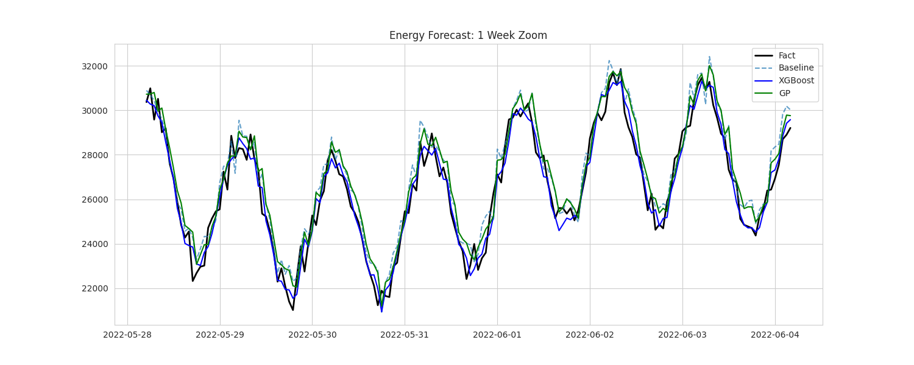

# ЗВІТ з практичного заняття №14: Наука і техніка

**Тема:** Прогнозування енергоспоживання (Track A)
**Студентка:** Зоріна Софія

## 1. Постановка задачі
**Мета:** Побудувати модель прогнозування погодинного енергоспоживання, що перевершує наївний сезонний прогноз. Точний прогноз важливий для балансування енергосистеми.

## 2. Дані
Використано погодинний часовий ряд (3 роки, ~26 тис. записів).
- **EDA:** Виявлено чітку добову (день/ніч) та тижневу (робочі/вихідні) сезонність.
- **Обробка:** Дані розділено на Train/Test без перемішування. Створено лагові ознаки (1h, 24h, 168h).

## 3. Методи
1. **Baseline:** `Seasonal Naive` (прогноз = значенню тиждень тому).
2. **XGBoost:** Градієнтний бустинг (500 дерев). Використовує лаги та календарні фічі.
3. **Genetic Programming:** Символьна регресія (`gplearn`). Еволюційний пошук формули.

## 4. Результати
**Графічний аналіз:**

**Метрики (Test Set):**
| Модель | MAE | RMSE | MAPE (%) |
| :--- | :--- | :--- | :--- |
| Baseline | 656.02 | 818.25 | 3.01% |
| Genetic Programming | 574.84 | 717.98 | 2.66% |
| **XGBoost** | **446.51** | **557.41** | **2.06%** |

## 5. Висновки
1. **Ефективність:** Класичний ML (XGBoost) найкраще впорався з задачею, знизивши помилку на ~30% відносно бази.
2. **Альтернатива:** Генетичне програмування знайшло валідну формулу, яка також краща за наївний прогноз.
3. **Що далі:** Можна додати дані про температуру повітря для покращення точності.

## 6. Технічна інформація
Залежності: `pandas`, `xgboost`, `gplearn`. Код відтворюваний (seed=42).
